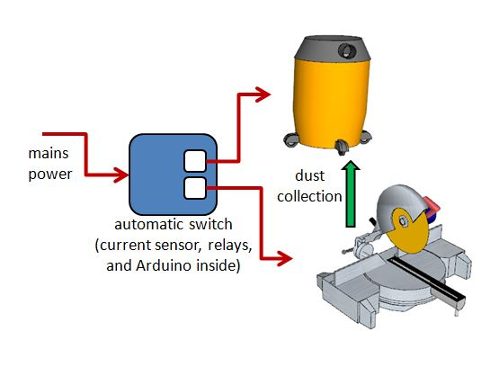

# Automatic Dust Control Vacuum Switch

This project implements the hardware and software needed to monitor a woodworking power saw and determine if it is on. Whenever the saw is running, a switch is triggered to automatically turn on a connected vacuum and remove sawdust. To clear the hose, the vacuum is kept running for a set time after the saw is turned off.

A lockout switch has been integrated so that the saw can be fully disabled without having to unplug it. A software switch locks out the saw after a fixed idle period, even if the lock key is left "on" (I did this because I have kids around and was terrified I'd one day forget to unplug the saw or otherwise lock it out).

A separate external switch allows the vacuum to be turned on, even if the saw is off.

While the intended use is a power saw / dust control system, in practice the setup works for any pair of appliances plugged into the switch box. It's basically a high-current electrical relay, but with fancy timeouts, overrides, and other special functionality.



The project was inspired by the "proper" solution [iVAC at Lee Valley](https://www.leevalley.com/en-ca/shop/tools/workshop/dust-collection/parts-and-accessories/63013-ivac-automatic-vacuum-switch):


# Hardware

The hardware consists of:
1. an Arduino Uno (yes, I know it's overkill; if I had to do it again, I'd use an ESP8266 or an ATTiny)
2. a solid-state relay
3. a common household electrical switch
4. a common household electrical outlet

To make it robust enough for the shop, everything is packaged into a (grounded!) metal box (an old computer power supply enclosure).


# Software

The C++ code for Arduino has the following notable items:

```
code goes here
```

