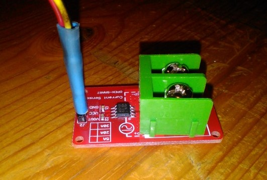

# Automatic Vacuum Switch - Software & Hardware

This software monitors a plugged-in appliance to determine if it is on. Whenever this master device is on, a switch is triggered to turn on a second electric appliance. It's basically a high-current relay setup.

The intended use is to automatically turn on a dust collection system whenever a woodworking tool is running.

The project was inspired by the "proper" solution shown below:

[iVAC at Lee Valley](https://www.leevalley.com/en-ca/shop/tools/workshop/dust-collection/parts-and-accessories/63013-ivac-automatic-vacuum-switch)

# Hardware

The hardware consists of an Arduino (yes, I know it's overkill!), a solid-state relay, and a common electrical switch and outlet. To make it sufficiently robust and dust-protected for the shop, the items are packaged into a metal box (and old computer power supply enclosure).

# Software

I know it's overkill - I used an Arduino to control this switch. If I had to do it again, I'd use an ESP8266 or an ATTiny.

In any event, the C++ code for Arduino has the following notable items:

