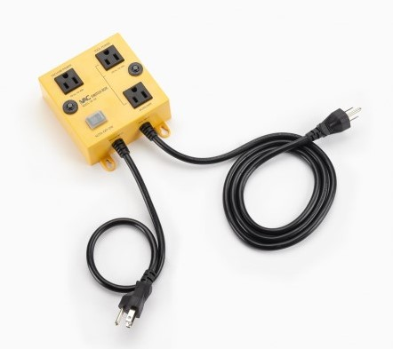

# Automatic Dust Control Vacuum Switch

This project implements the hardware and software needed to monitor a woodworking power saw and determine if it is on. Whenever the saw is running, a switch is triggered to automatically turn on a connected vacuum and remove sawdust. To clear the hose, the vacuum is kept running for a set time after the saw is turned off.

A lockout switch has been integrated so that the saw can be fully disabled without having to unplug it. A software switch locks out the saw after a fixed idle period, even if the lock key is left "on" (I did this because I have kids around and was terrified I'd one day forget to unplug the saw or otherwise lock it out).

A separate external switch allows the vacuum to be turned on, even if the saw is off.

While the intended use is a power saw / dust control system, in practice the setup works for any pair of appliances plugged into the switch box. It's basically a high-current electrical relay, but with fancy timeouts, overrides, and other special functionality.


The project was inspired by the "proper" solution [iVAC at Lee Valley](https://www.leevalley.com/en-ca/shop/tools/workshop/dust-collection/parts-and-accessories/63013-ivac-automatic-vacuum-switch):



**disclaimer: I coded and built this project a couple of years ago, and haven't looked at it since. This is actually good news, because it means the automatic switch has run reliably for years. But it means that I am now essentially reverse-engineering my own work so that I can post it here for others. I think I got the details right, but don't be too surprised if not - please let me know if something looks off**

**WARNING! Electrical mains power is dangerous! So are power saws! I have not mentioned anything about safety aspects in these instructions. Please be sure to exercise appropriate caution if attempting this project.**


# Hardware

The hardware consists of:
1. Arduino Duemilanove (yes, I know it's overkill; if I had to do it again, I'd probably use an ESP8266 or an ATTiny)
2. Electrical Relays (I used 2 solid-state relays)
3. Common household electrical switch
4. Common household electrical outlet

To make it robust enough for the shop, everything is packaged into a (grounded!) metal box, which I repurposed from an old computer power supply enclosure.


The main challenge is sensing electrical current to determine if the power saw is running. This is achieved using a standard [ACS712](https://www.sparkfun.com/datasheets/BreakoutBoards/0712.pdf) current sensing chip on a breakout board (note: it seems it's now been superseded by a more modern equivalent [ACS723](https://www.sparkfun.com/products/13679)):


The ACS712 measures input current, and outputs a signal voltage according to a linear profile (67mv/A):


We can use an Arduino to read the ACS712 and determine if the power saw is running. If it is, we turn on the dust collection vacuum. Software for this is covered in a later section.

# System Schematic


# Software

The C++ code for Arduino has the following notable items:

configuration inputs:
```
const double SAMPLING_TIME_SECONDS = 0.1;        // number of consecutive samples to take when calculating current
const double INIT_WINDOW_SECONDS = 0.5;          // once current is detected, time to wait before triggering SSR
const double END_WINDOW_SECONDS = 4;             // once current is ended, time to wait before stopping SSR
const double AMP_THRESHOLD_ACTIVATE_SSR = 0.4;   // Amps at which to trigger SSR
const double AMP_THRESHOLD_STOP_SSR = 0.3;       // Amps at which to trigger SSR
const long RUNTIME_UNTIL_TIMEOUT_MINUTES = 90;   // power saw mains will turn off after this time, even if power key is turned "ON"
```

A generic SwitchMonitor class is used to monitor the status on an input lock. The input lock can be:
* a physical switch, like a lockout key or a household light switch
* a sensor switch, like the ACS712 current monitor

Three SwitchMonitor instances are defined:
```
// input monitors
SwitchMonitor switch_manual;                     // a household electrical switch, that will be used to turn on the vacuum cleaner manually
SwitchMonitor switch_current_sensor;             // the ACS712 current sensor
SwitchMonitor switch_lockout_mains;              // a key switch that can be used to manually lockout / disable the power saw electricity
```

Each SwitchMonitor can have a timeout period (timeout_millis) specified, which is the maximum time that switch can be active. At each state check, that timer is decremented. When the timer reaches zero, the switch is turned off regardless of it's actual state. The switch then needs to be manually re-activated by cycling it off/on. This serves as a software lockout to cover the case where the power saw is unintentionally left energized.
```
    if (timeout_millis <= 0 && minutes_allowed_before_lockout >= 0){
      // lockout - turn it off now, regardless of other conditions
      // switch has to go from OFF to ON to reset timer (i.e. switch cycle)
      desired_state_of_output = logic_output_state_off;
    }
```

Monitor the lockout switch. If it's on, then turn the power saw relay ON (i.e. send electricity to the power saw). If the lockout switch is off (a user turns it off, or the timeout period reaches zero), then cut power to the saw. BUT, first check to see if the saw is currently running (in the middle of a cut) - if so, wait until that cut is done and then turn off the power. This is not meant as an emergency shutoff, just a timeout to cover forgetting to lockout the saw with the key switch.

```
  switch_lockout_mains.Update( currentMillis, digitalRead(PIN_LOCK_SWITCH) );
  if (switch_lockout_mains.desired_state_of_output == SAW_RELAY_ON){
    digitalWrite(PIN_POWERSAW, SAW_RELAY_ON);
  }else{
    if(get_digital_read_from_current_sensor(PIN_ANALOG) != CURRENT_ON){
      // don't kill the power if saw is running (might ruin a workpiece if lockout timer triggers when saw is mid-cut)
      // this means we cannot use this circuit for any kind of emergency shutoff!
      digitalWrite(PIN_POWERSAW, SAW_RELAY_OFF);
    }else{
      if (DEBUG_MODE){
        Serial.println("take no timeout action because saw is reported as running");
      }
    }
  }
```

Separately monitor a manual switch (the household light switch). If it's ON, turn on the vacuum relay (even if the power saw is off). Alternately, if the ACS712 reports that the power saw is on, turn on the vacuum relay.
```
  switch_manual.Update( currentMillis, digitalRead(PIN_MANUAL) );
  switch_current_sensor.Update( currentMillis, get_digital_read_from_current_sensor(PIN_ANALOG) );
  if (switch_manual.desired_state_of_output == SSR_ON || switch_current_sensor.desired_state_of_output == SSR_ON){
    digitalWrite(PIN_SSR, SSR_ON);
  }else{
    digitalWrite(PIN_SSR, SSR_OFF);
  }
```

This is alternating current (AC), so the ACS712 voltage output will also be dynamic. For this reason, we need to take [RMS](https://en.wikipedia.org/wiki/Root_mean_square#Voltage) readings, which are peak voltage divided by the square root of 2:
```
rms_voltage = ((max_voltage_reading - min_voltage_reading)/2.0) *0.7071;
```

